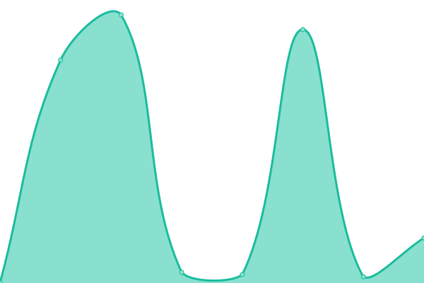

# [📈 Live Status](https://Technikermathe.github.io/upptime): <!--live status--> **🟧 Partial outage**

This repository contains the open-source uptime monitor and status page for [Technikermathe](https://Technikermathe.github.io/upptime), powered by [Upptime](https://github.com/upptime/upptime).

With [Upptime](https://upptime.js.org), you can get your own unlimited and free uptime monitor and status page, powered entirely by a GitHub repository. We use [Issues](https://github.com/Technikermathe/upptime/issues) as incident reports, [Actions](https://github.com/Technikermathe/upptime/actions) as uptime monitors, and [Pages](https://Technikermathe.github.io/upptime) for the status page.

<!--start: status pages-->
<!-- This summary is generated by Upptime (https://github.com/upptime/upptime) -->
<!-- Do not edit this manually, your changes will be overwritten -->
<!-- prettier-ignore -->
| URL | Status | History | Response Time | Uptime |
| --- | ------ | ------- | ------------- | ------ |
|  [Homepage](https://technikermathe.de) | 🟩 Up | [homepage.yml](https://github.com/Technikermathe/upptime/commits/HEAD/history/homepage.yml) | 

 1338ms
     
 | 

<a href="https://status.technikermathe.de/history/homepage">98.74%</a>
    

|  [Homepage - www](https://www.technikermathe.de) | 🟩 Up | [homepage-www.yml](https://github.com/Technikermathe/upptime/commits/HEAD/history/homepage-www.yml) | 

 1561ms
     
 | 

<a href="https://status.technikermathe.de/history/homepage-www">98.74%</a>
    

|  [Courses](https://technikermathe.de/onlinekurse) | 🟩 Up | [courses.yml](https://github.com/Technikermathe/upptime/commits/HEAD/history/courses.yml) | 

 924ms
     
 | 

<a href="https://status.technikermathe.de/history/courses">99.94%</a>
    

|  [Intro course](https://technikermathe.de/kurse/info-rund-um-das-technikerstudium) | 🟩 Up | [intro-course.yml](https://github.com/Technikermathe/upptime/commits/HEAD/history/intro-course.yml) | 

 461ms
     
 | 

<a href="https://status.technikermathe.de/history/intro-course">99.94%</a>
    

|  [School Directory - overview](https://technikermathe.de/kurse/technikerschulen-verzeichnis-deutschlandweit) | 🟩 Up | [school-directory-overview.yml](https://github.com/Technikermathe/upptime/commits/HEAD/history/school-directory-overview.yml) | 

 461ms
     
 | 

<a href="https://status.technikermathe.de/history/school-directory-overview">99.94%</a>
    

|  [School Directory - Baden](https://technikermathe.de/lektionen/technikerschulen-in-baden-wuerttemberg) | 🟩 Up | [school-directory-baden.yml](https://github.com/Technikermathe/upptime/commits/HEAD/history/school-directory-baden.yml) | 

 4016ms
     
 | 

<a href="https://status.technikermathe.de/history/school-directory-baden">86.42%</a>
    

|  [School Directory - Bavaria](https://technikermathe.de/lektionen/technikerschulen-in-bayern) | 🟩 Up | [school-directory-bavaria.yml](https://github.com/Technikermathe/upptime/commits/HEAD/history/school-directory-bavaria.yml) | 

 3843ms
     
 | 

<a href="https://status.technikermathe.de/history/school-directory-bavaria">86.42%</a>
    

|  [School Directory - Berlin](https://technikermathe.de/lektionen/technikerschulen-in-berlin) | 🟩 Up | [school-directory-berlin.yml](https://github.com/Technikermathe/upptime/commits/HEAD/history/school-directory-berlin.yml) | 

 1202ms
     
 | 

<a href="https://status.technikermathe.de/history/school-directory-berlin">99.86%</a>
    

|  Kafka - Broker | 🟥 Down | [kafka-broker.yml](https://github.com/Technikermathe/upptime/commits/HEAD/history/kafka-broker.yml) | 

 0ms
     
 | 

<a href="https://status.technikermathe.de/history/kafka-broker">99.91%</a>
    

|  WordPress | 🟥 Down | [word-press.yml](https://github.com/Technikermathe/upptime/commits/HEAD/history/word-press.yml) | 

 0ms
     
 | 

<a href="https://status.technikermathe.de/history/word-press">99.91%</a>
    

|  DBS | 🟥 Down | [dbs.yml](https://github.com/Technikermathe/upptime/commits/HEAD/history/dbs.yml) | 

 0ms
     
 | 

<a href="https://status.technikermathe.de/history/dbs">99.91%</a>
    

<!--end: status pages-->

[**Visit our status website →**](https://Technikermathe.github.io/upptime)

## 📄 License

- Powered by: [Upptime](https://github.com/upptime/upptime)
- Code: [MIT](./LICENSE) © [Technikermathe](https://Technikermathe.github.io/upptime)
- Data in the `./history` directory: [Open Database License](https://opendatacommons.org/licenses/odbl/1-0/)
