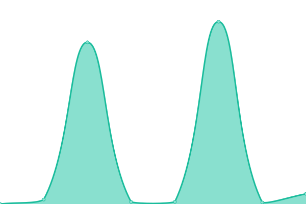

# [📈 Live Status](https://Technikermathe.github.io/upptime): <!--live status--> **Alle Systeme erreichbar**

This repository contains the open-source uptime monitor and status page for [Technikermathe](https://Technikermathe.github.io/upptime), powered by [Upptime](https://github.com/upptime/upptime).

With [Upptime](https://upptime.js.org), you can get your own unlimited and free uptime monitor and status page, powered entirely by a GitHub repository. We use [Issues](https://github.com/Technikermathe/upptime/issues) as incident reports, [Actions](https://github.com/Technikermathe/upptime/actions) as uptime monitors, and [Pages](https://Technikermathe.github.io/upptime) for the status page.

<!--start: status pages-->
<!-- This summary is generated by Upptime (https://github.com/upptime/upptime) -->
<!-- Do not edit this manually, your changes will be overwritten -->
<!-- prettier-ignore -->
| URL | Status | History | Response Time | Uptime |
| --- | ------ | ------- | ------------- | ------ |
|  [Homepage](https://technikermathe.de) | Up | [homepage.yml](https://github.com/Technikermathe/upptime/commits/HEAD/history/homepage.yml) | 

 449ms
     
 | 

<a href="https://status.technikermathe.de/history/homepage">100.00%</a>
    

|  [Homepage - www](https://www.technikermathe.de) | Up | [homepage-www.yml](https://github.com/Technikermathe/upptime/commits/HEAD/history/homepage-www.yml) | 

 410ms
     
 | 

<a href="https://status.technikermathe.de/history/homepage-www">100.00%</a>
    

|  [Courses](https://technikermathe.de/onlinekurse) | Up | [courses.yml](https://github.com/Technikermathe/upptime/commits/HEAD/history/courses.yml) | 

 59ms
     
 | 

<a href="https://status.technikermathe.de/history/courses">100.00%</a>
    

|  [Membership](https://technikermathe.de/mitgliedschaft) | Up | [membership.yml](https://github.com/Technikermathe/upptime/commits/HEAD/history/membership.yml) | 

 51ms
     
 | 

<a href="https://status.technikermathe.de/history/membership">100.00%</a>
    

|  [Intro course](https://technikermathe.de/kurse/info-rund-um-das-technikerstudium) | Up | [intro-course.yml](https://github.com/Technikermathe/upptime/commits/HEAD/history/intro-course.yml) | 

 62ms
     
 | 

<a href="https://status.technikermathe.de/history/intro-course">100.00%</a>
    

|  [School Directory - overview](https://technikermathe.de/kurse/technikerschulen-verzeichnis-deutschlandweit) | Up | [school-directory-overview.yml](https://github.com/Technikermathe/upptime/commits/HEAD/history/school-directory-overview.yml) | 

 54ms
     
 | 

<a href="https://status.technikermathe.de/history/school-directory-overview">100.00%</a>
    

|  [School Directory - Berlin](https://technikermathe.de/lektionen/technikerschulen-in-berlin) | Up | [school-directory-berlin.yml](https://github.com/Technikermathe/upptime/commits/HEAD/history/school-directory-berlin.yml) | 

 277ms
     
 | 

<a href="https://status.technikermathe.de/history/school-directory-berlin">100.00%</a>
    

|  [Landingpage](https://technikermathe.de/me1-biegebeanspruchung-biegung) | Up | [landingpage.yml](https://github.com/Technikermathe/upptime/commits/HEAD/history/landingpage.yml) | 

 57ms
     
 | 

<a href="https://status.technikermathe.de/history/landingpage">100.00%</a>
    

<!--end: status pages-->

[**Visit our status website →**](https://Technikermathe.github.io/upptime)

## 📄 License

- Powered by: [Upptime](https://github.com/upptime/upptime)
- Code: [MIT](./LICENSE) © [Technikermathe](https://Technikermathe.github.io/upptime)
- Data in the `./history` directory: [Open Database License](https://opendatacommons.org/licenses/odbl/1-0/)
